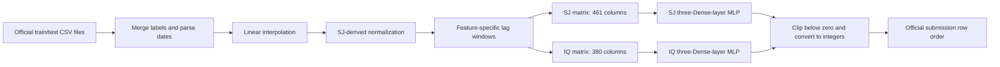

# Feature-specific lag MLP: code and experiment guide

This is the canonical guide to the self-contained neural-network workflow. The
implementation under `src/feature_lag_mlp/` is sufficient to prepare data,
train, validate, tune, and export a competition submission. It does not import
code or load weights from `vendors/`.

## Read the code in this order

| Order | File | One responsibility |
|---:|---|---|
| 1 | `config.py` | Features, lag lengths, model profiles, and training defaults |
| 2 | `data.py` | Read the four official CSV files, merge labels, and interpolate |
| 3 | `features.py` | Normalize values and construct flattened history vectors |
| 4 | `model.py` | Define the two-hidden-layer MLP |
| 5 | `training.py` | Fit a model, post-process predictions, and assemble a submission |
| 6 | `search_space.py` | Declare the controlled architecture experiments |
| 7 | `validation.py` | Build temporal folds and calculate normal/outbreak MAE |
| 8 | `train.py` | Orchestrate one full-data training run |
| 9 | `tune.py` | Orchestrate search, confirmation, and a seed ensemble |

The files `src/train_feature_lag_mlp.py` and
`src/tune_feature_lag_mlp.py` are deliberately tiny command-line entry points.
They make the familiar commands stable while keeping the logic in the package.

## End-to-end workflow



Training and tuning share the same path through data, features, model, and
post-processing. This is important: a validation result is useful only when it
measures the same transformations used for the final submission.

## 1. What the data says

The two cities are different prediction problems, not interchangeable samples.

| City | Rows | Mean cases | Median | 90th percentile | Maximum | Zero weeks |
|---|---:|---:|---:|---:|---:|---:|
| San Juan (SJ) | 936 | 34.18 | 19 | 71.0 | 461 | 0.43% |
| Iquitos (IQ) | 520 | 7.57 | 5 | 19.1 | 116 | 18.46% |

SJ has both more observations and much larger outbreaks. IQ is smaller and
zero-inflated. This is why the workflow trains one model per city and tunes the
two architectures separately.

The target is also strongly time-dependent:

| City | lag-1 correlation | lag-2 | lag-4 | lag-52 |
|---|---:|---:|---:|---:|
| SJ | 0.965 | 0.920 | 0.814 | 0.045 |
| IQ | 0.747 | 0.585 | 0.490 | 0.008 |

Adjacent weeks are similar, but the same calendar week in another year is not
enough by itself to predict the outbreak size. Climate history can therefore be
more useful than a simple week-of-year lookup. The annual SJ mean also ranges
from 6.24 to 125.63 cases, showing why a random split would give an unrealistically
easy validation set.

## 2. Preprocessing

### Load and interpolate

`load_competition_data()` merges features and labels by
`city, year, weekofyear`, parses dates, and verifies that test keys exactly
match the supplied submission template.

`interpolate_numeric()` performs linear interpolation on numeric columns in
the original file order. The official file places all SJ rows before all IQ
rows. This global order is retained for reproduction; it is a compatibility
choice, not a recommendation for a new forecasting system.

### Normalize

The confirmed `shared-sj` mode calculates each weather feature's mean and
standard deviation from SJ and applies those values to both cities. Week number
uses SJ min-max scaling. This looked suspicious, so it was tested against
city-specific statistics; the city-specific version scored 19.8 rather than
19.5 on the leaderboard. The stronger shared-SJ result is therefore retained
as an empirical model choice.

The most plausible explanation is not simply that SJ has more rows. Shared
scaling also changes the numerical position of IQ relative to the fixed SELU
network, its initialization, RMSprop updates, and dropout. Treat this behavior
as part of the trained model, rather than as universally correct preprocessing.

### Construct feature-specific histories

There are 16 weather variables plus `weekofyear`. Each variable has its own
history length. For example, the SJ model receives 40 weeks of precipitation,
16 weeks of reanalysis air temperature, and 3 weeks of week number. The vectors
are concatenated:

```text
x(t) = [precipitation history | temperature history | ... | week history]
```

The lag lengths are stored visibly in `config.py`. Their sums give the model
input dimensions:

```text
SJ: 461 input values
IQ: 380 input values
```

The source project labelled these values as PPS-selected. Its V9 notebook does
contain the scoring procedure: for each city, feature, and candidate history
length from 3 through 51, it fits a `DecisionTreeRegressor` using only that
feature's history vector and records mean 10-fold negative MAE. It then draws a
feature-by-window heatmap. This is a PPS-like predictive-utility screen, not a
formal normalized Predictive Power Score.

The notebook does not contain an automatic `argmax` that produces the final
window dictionaries. V10 introduces the selected values directly, so they were
apparently chosen by inspecting the heatmaps. We preserve those values as fixed
configuration and do not claim the manual selection is deterministic end to
end.

### The two-row alignment behavior

The feature builder prefixes every city with its last 53 training rows, then
starts reading at combined-row 51. During training this circularly reorders the
last two observations to the front. During test prediction it means:

- test row 1 uses history ending at the second-to-last training row;
- test row 2 uses history ending at the last training row;
- test row 3 uses history ending at test row 1;
- in general, a test prediction uses observed climate through two rows earlier.

This is effectively a two-week feature delay. It is unusual, but it is part of
the leaderboard-confirmed behavior, so `_flatten_history_rows()` documents and
tests it rather than silently “fixing” it.

## 3. Model

“Three layers” means three **Dense** layers: two hidden layers and one output
layer. The Input and Dropout operations have no learned Dense weights and are
not counted as MLP layers.

```text
flattened climate history
    → Dense(hidden_1, SELU)
    → Dropout(dropout_1)
    → Dense(hidden_2, SELU)
    → Dropout(dropout_2)
    → Dense(1, linear)
```

The loss is MAE, matching the competition metric. Optimization uses RMSprop.
Negative predictions are clipped to zero and raw outputs are converted to
integers exactly as they are for a submission.

| Profile | SJ hidden | SJ dropout | IQ hidden | IQ dropout |
|---|---:|---:|---:|---:|
| `reference` | 100 → 50 | 0.50 → 0.50 | 70 → 35 | 0.50 → 0.50 |
| `improved` / 19.1 control | 100 → 50 | 0.30 → 0.70 | 70 → 35 | 0.50 → 0.50 |
| `tuned` local-CV winner | 100 → 25 | 0.30 → 0.70 | 70 → 18 | 0.50 → 0.50 |

The first value in a dropout pair is applied after hidden layer 1; the second
is applied after hidden layer 2. There is no dropout on the raw input or output.

## 4. Training behavior

`fit_arrays()` is the single training function used by final fits and temporal
validation. It uses:

- 40 epochs;
- 200 repeated batches per epoch;
- batch size 16;
- SJ shuffle buffer 500, with IQ kept in order;
- city-specific learning rates: 0.01 for SJ and 0.001 for IQ;
- `ReduceLROnPlateau` on training MAE.

The default scheduler direction is `max`, even though `min` is logically
correct for MAE. `max` reproduces the confirmed historical behavior and `min`
is exposed as an explicit ablation. This is another example of preserving a
measured pipeline while clearly labelling the odd choice.

## 5. Validation and error analysis

Random train/validation splits leak nearby outbreak states because adjacent
targets are highly correlated. `temporal_folds()` instead makes expanding
training prefixes followed by non-overlapping 52-week validation blocks:

```text
fold 1: [past training................][52 validation weeks]
fold 2: [past training............................][52 validation weeks]
fold 3: [past training........................................][52 validation weeks]
```

For each candidate, `fit_candidate()` reports:

- ordinary MAE after submission post-processing;
- outbreak MAE on validation targets above the training-label 90th percentile;
- prediction mean and maximum, to reveal collapsed or explosive models;
- final training MAE, to help identify generalization gaps.

Candidates are ranked by:

```text
selection score = mean validation MAE + 0.10 × standard deviation
```

The small penalty discourages a model that wins only because of a lucky
fold/seed. Broad search uses one seed; finalists are confirmed on three folds
and seeds 17, 42, and 73. The 19.1 setup is always included as the control.

## 6. What tuning found

Only hidden widths, the two dropout rates, and learning rate were searched. No
feature representation or model depth changed.

| City | Configuration | Mean MAE | Worst MAE | Outbreak MAE |
|---|---|---:|---:|---:|
| SJ | 100 → 50 control | 22.019 | 35.673 | 63.117 |
| SJ | **100 → 25 selected** | **20.635** | **31.942** | **57.095** |
| IQ | 70 → 35 control | 8.173 | 12.827 | **22.974** |
| IQ | **70 → 18 selected** | **7.908** | **12.481** | 23.244 |

The useful change was a narrower second hidden layer, not a deeper network or
more aggressive regularization. A 461- or 380-value input already gives the MLP
many degrees of freedom. The smaller bottleneck reduces capacity immediately
before the output while retaining the first layer's ability to combine lagged
signals.

The competition-row-weighted local mean improved from 16.827 to 15.862, a
0.965-MAE gain. Most of the evidence comes from SJ. IQ improved ordinary MAE
slightly but worsened outbreak MAE slightly, so the SJ-only candidate remains a
useful leaderboard diagnostic. Local temporal validation is evidence of a
better configuration; it is not proof of a better hidden-test score.

### Hidden leaderboard result: use seed 42, not the mean ensemble

The leaderboard supplied the final comparison that local validation could not:

| Final prediction strategy | Hidden-test MAE |
|---|---:|
| Tuned architecture, seed 42 | **18.8** |
| Tuned architecture, raw mean of seeds 17, 42, and 73 | 19.5 |

The seed predictions are highly correlated, so the ensemble provides little
independent-error cancellation. Pairwise correlations are 0.970–0.978 for SJ
and 0.956–0.963 for IQ. More importantly, the other seeds lower the SJ
prediction amplitude: seed 42 has mean 36.04 and maximum 174, while the ensemble
has mean 33.66 and maximum 161. That smoothing likely increases underprediction
during outbreaks.

This does not mean ensembling is always harmful. For absolute error, averaging
can improve on the average member but is not guaranteed to improve on the best
member. Here seed 42 is empirically the best member. It is therefore the
default final seed; `17,42,73` remains available only to reproduce the ensemble
experiment.

Detailed tables are in `artifacts/feature_lag_mlp_tuning_*_summary.csv` and the
short experiment report is `artifacts/feature_lag_mlp_tuning_report.md`.

### Generate presentation figures

The visualization script reads the raw data and the confirmation CSVs; it does
not train a model. It produces four PNG files covering target distributions and
timelines, autocorrelation, candidate MAE, and overall-versus-outbreak error:

```bash
../../.venv/bin/python src/visualize_feature_lag_mlp.py
```

The default destination is `artifacts/feature_lag_mlp_figures/`. Use
`--output-dir` to write elsewhere. The plotting functions are separate and
named after the question each figure answers, so the file can also be read as
an example of the error-analysis workflow.

## 7. Commands

Check transformations and shapes without loading TensorFlow:

```bash
.venv-tf/bin/python src/train_feature_lag_mlp.py --prepare-only
```

Train one documented profile:

```bash
.venv-tf/bin/python src/train_feature_lag_mlp.py --profile improved --seed 42
.venv-tf/bin/python src/train_feature_lag_mlp.py --profile tuned --seed 42
```

Run the full temporal search and confirmation:

```bash
.venv-tf/bin/python src/tune_feature_lag_mlp.py
```

Rebuild the final seed-42 submission from saved confirmation summaries:

```bash
.venv-tf/bin/python src/tune_feature_lag_mlp.py --reuse-confirmation-results
```

Reproduce the lower-scoring three-seed ensemble explicitly:

```bash
.venv-tf/bin/python src/tune_feature_lag_mlp.py \
  --reuse-confirmation-results --final-seeds 17,42,73
```

Run the focused tests:

```bash
.venv-tf/bin/python -m unittest \
  tests.test_feature_lag_mlp tests.test_tune_feature_lag_mlp
```

## 8. Inherited behavior versus work done here

| Inherited and reproduced | Added or tested in this repository |
|---|---|
| Feature-specific history lengths | Self-contained package with no external-code dependency |
| Shared SJ normalization | City-specific normalization ablation |
| Two-row feature delay | Explicit documentation and shape/parity tests |
| SELU, Dropout, RMSprop, MAE | Dropout experiments, AlphaDropout, BatchNorm, residual models |
| Two hidden Dense layers | Time-aware multi-fold, multi-seed architecture search |
| Historical 40 × 200 schedule | Outbreak MAE and stability-aware selection |
| 100 → 50 SJ and 70 → 35 IQ widths | Selected 100 → 25 SJ and 70 → 18 IQ widths |

Experiments such as AlphaDropout, BatchNorm, U-Net-like/residual changes, and
the residual temporal network did not improve the hidden leaderboard result;
some failed badly. The lesson is that architecture names are not improvements
by themselves. With only 936 SJ and 520 IQ labels, validation design and model
capacity matter more than adding components.

### Controlled complexity and augmentation experiment

The clean package also supports two optional robustness experiments without
changing the default model:

- a regularized linear input-to-output skip branch;
- feature-block climate noise applied only during training.

The full two-fold screen kept the unchanged model in first place for both
cities. SJ control/noise-0.005 mean MAE was 17.856/17.962; IQ was 7.846/8.087.
The linear skip was clearly harmful, especially for SJ, where mean MAE rose to
24.663. The only promising secondary signal was SJ outbreak MAE: noise 0.005
reduced it from 35.818 to 29.091 while slightly worsening ordinary MAE.

Therefore the 18.8 seed-42 model remains the recommendation. The augmentation
is retained as an outbreak-focused research option, not promoted as a better
submission. Full results and rationale are in
`artifacts/feature_lag_mlp_robustness_report.md`.

Run the isolated screen with:

```bash
.venv-tf/bin/python src/experiment_feature_lag_mlp_robustness.py
```

### Causal multiscale representation

A stronger experiment replaces individual lag positions with 180 causal
summary features: current level, 2/4/8/13/26/52-week means, 4/13-week
variability, short-vs-medium change, 13-week trend, and two seasonal harmonics.

Three-fold, three-seed confirmation improves SJ mean MAE from 20.635 to 17.726
and IQ from 7.908 to 7.588. The weighted local mean improves by 1.938 MAE. A
raw-plus-summary representation is worse, showing that the benefit comes from
removing redundant lag coordinates rather than making the input larger.

The SJ-only candidate then scored **16.6 hidden-test MAE**, a 2.2-point gain
over the 18.8 seed-42 model. Since IQ was unchanged, this corresponds to an
approximately 3.52-MAE improvement on the hidden SJ rows. This is strong
evidence that feature representation—not additional network depth—was the main
bottleneck.

The SJ-only and both-city candidates both scored **16.6**:

```text
artifacts/submission_feature_lag_mlp_multiscale_summaries_seed42_sj_only.csv
artifacts/submission_feature_lag_mlp_multiscale_summaries_seed42.csv
```

Therefore the multiscale representation clearly improves SJ, while changing IQ
is approximately neutral at the leaderboard's displayed precision.

The MLP was subsequently retuned for the smaller 180-value input. Across three
temporal folds and three seeds, a `48 → 12` network reached 17.502 local MAE,
versus 17.726 for the `100 → 25` control. Because this 0.224 gain is small and
outbreak MAE worsened from 55.844 to 57.338, it was tested only as a diagnostic:

```text
artifacts/submission_feature_lag_mlp_multiscale_architecture_seed42_sj_only.csv
```

It scored **18.1 MAE**, 1.5 worse than the 16.6 control. Since only the 260 SJ
rows changed, this corresponds to an estimated hidden-SJ degradation of
`1.5 / (260 / 416) = 2.4 MAE`. The narrow network's apparent local advantage
was therefore selection noise. Freeze the `100 → 25` model and direct the next
experiments toward feature representation.

Reproduce the bounded width/dropout/learning-rate screen with:

```bash
.venv-tf/bin/python src/tune_multiscale_feature_lag_mlp.py
```

See `artifacts/feature_lag_mlp_representation_report.md` for full results and
the exact reproduction commands.

## 9. Repository boundary

`/vendors/` is anchored in `.gitignore`. The canonical package contains the
needed constants and logic, and no file in this workflow imports from that
directory. Before publishing, this can be verified with:

```bash
git check-ignore -v vendors/dengai-predicting-disease-spread/README.md
rg "vendors/|vendor_dir" src/feature_lag_mlp \
  src/train_feature_lag_mlp.py src/tune_feature_lag_mlp.py
```

The first command should show the ignore rule. The second should return no code
dependency.
